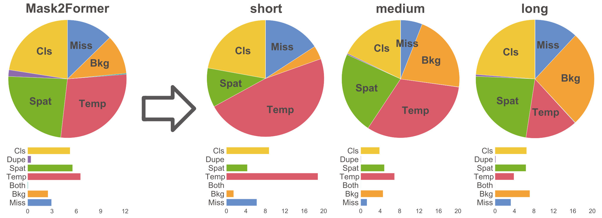

# Abstract

<html>
<style>
    .abstract_table tr td{
        border-top-style: hidden;
        border-bottom-style: hidden;
        border-left-style: hidden;
        border-right-style: hidden;
        }
    p {
        text-align:justify;
    }
</style>
<table class="abstract_table">
    <tr style="height:auto;">
        <td style="width:30%;">
            
        </td>
        <td style="width:70%;text-align:justify">
            <font size=5><b>TIVE</b></font> is a Toolbox for Identifying Video instancne segmentation Errors. By directly operating output prediction files, TIVE can isolate error predictions and weight each type’s demage to mAP, in purpose of distinguishing model charactors. By decomposing localization quality in spatial-temporal dimensions, model’s potential drawbacks on spatial segmentation and temporal association can be clearly revealed. TIVE can also report mAP over instance temporal length for real applications. <a href="https://arxiv.org/abs/1911.12451" target=_blank><b>UAP</b></a> and <a href="https://dbolya.github.io/tide/" target=_blank><b>TIDE</b></a> are the formerly introduced error analyzing tools for image-level object recognition.

We expect that the analysis of TIVE can give the researchers more insights, guiding the community to promote more meaningful explorations for video instance segmentation.

</td>
</tr>
</table>
</html>

# Error Types
<div align=center>
    
</div>
<p>
    <font size=5><b>TIVE </b></font>bin false positives and false negatives produced by a model into 7 types, including general object recognition errors and two spatial-temporal localization errors with specific focus on spatial segmentation and temporal association quality of predicted mask sequence.
</p>

# Distribution of Errors
<div align=center>
    
</div>
<p>
    Clear pictures are given to show errors produced by models cross all temporal length, effect of each to the evaluation metric is weighted by individually fixing oracle. Users can observe what prevents their model to achieve higher mAP.
</p>

# Model Summary
Experiments conducted by TIVE show that recognizing short video instances is especially challenging, mAP corss temporal ranges and error distributions for all models selected by our paper are shown below.
<html>
<div class="mst_fa">
<table class="model_summary_table" >
<thead>
  <tr>
    <th class="model_summary_table-9wq8" rowspan="2">Method</th>
    <th class="model_summary_table-9wq8" rowspan="2">Training<br>Frames</th>
    <th class="model_summary_table-9wq8" colspan="4">Metrics </th>
    <th class="model_summary_table-9wq8" colspan="7">Error Weights(&Delta;AP@50)</th>
  </tr>
  <tr>
    <th class="model_summary_table-hxaf">mAP</th>
    <th class="model_summary_table-hxaf">mAP<sub>s</sub></th>
    <th class="model_summary_table-hxaf">mAP<sub>m</sub></th>
    <th class="model_summary_table-hxaf">mAP<sub>l</sub></th>
    <th class="model_summary_table-hxaf">Cls</th>
    <th class="model_summary_table-hxaf">Dup</th>
    <th class="model_summary_table-hxaf">Spat</th>
    <th class="model_summary_table-hxaf">Temp</th>
    <th class="model_summary_table-hxaf">Both</th>
    <th class="model_summary_table-hxaf">Bkg</th>
    <th class="model_summary_table-hxaf">Miss</th>
  </tr>
</thead>
<tbody>
  <tr>
    <td class="model_summary_table-9wq8">Mask Track R-CNN</td>
    <td class="model_summary_table-9wq8">T=2</td>
    <td class="model_summary_table-9wq8">36.30</td>
    <td class="model_summary_table-9wq8">10.44</td>
    <td class="model_summary_table-9wq8">35.87</td>
    <td class="model_summary_table-9wq8">43.43</td>
    <td class="model_summary_table-9wq8">7.50</td>
    <td class="model_summary_table-9wq8">0.00</td>
    <td class="model_summary_table-9wq8">6.98</td>
    <td class="model_summary_table-9wq8">6.36</td>
    <td class="model_summary_table-9wq8">0.24</td>
    <td class="model_summary_table-9wq8">0.94</td>
    <td class="model_summary_table-9wq8">6.08</td>
  </tr>
  <tr>
    <td class="model_summary_table-b406">VISOLO</td>
    <td class="model_summary_table-b406">T=3</td>
    <td class="model_summary_table-b406">38.49</td>
    <td class="model_summary_table-b406">8.58</td>
    <td class="model_summary_table-b406">39.31</td>
    <td class="model_summary_table-b406">40.94</td>
    <td class="model_summary_table-b406">12.35</td>
    <td class="model_summary_table-b406">0.00</td>
    <td class="model_summary_table-b406">2.74</td>
    <td class="model_summary_table-b406">8.97</td>
    <td class="model_summary_table-b406">0.09</td>
    <td class="model_summary_table-b406">0.86</td>
    <td class="model_summary_table-b406">5.84</td>
  </tr>
  <tr>
    <td class="model_summary_table-9wq8">IFC</td>
    <td class="model_summary_table-9wq8">T=5</td>
    <td class="model_summary_table-9wq8">40.27</td>
    <td class="model_summary_table-9wq8">20.44</td>
    <td class="model_summary_table-9wq8">38.98</td>
    <td class="model_summary_table-9wq8">40.98</td>
    <td class="model_summary_table-9wq8">7.03</td>
    <td class="model_summary_table-9wq8">0.02</td>
    <td class="model_summary_table-9wq8">6.93</td>
    <td class="model_summary_table-9wq8">10.99</td>
    <td class="model_summary_table-9wq8">0.38</td>
    <td class="model_summary_table-9wq8">1.20</td>
    <td class="model_summary_table-9wq8">4.72</td>
  </tr>
  <tr>
    <td class="model_summary_table-b406">SeqFormer</td>
    <td class="model_summary_table-ezbu">T=5</td>
    <td class="model_summary_table-b406">43.37</td>
    <td class="model_summary_table-b406">21.69</td>
    <td class="model_summary_table-b406">40.43</td>
    <td class="model_summary_table-b406">39.20</td>
    <td class="model_summary_table-b406">6.95</td>
    <td class="model_summary_table-b406">0.25</td>
    <td class="model_summary_table-b406">7.69</td>
    <td class="model_summary_table-b406">4.00</td>
    <td class="model_summary_table-b406">0.00</td>
    <td class="model_summary_table-b406">0.97</td>
    <td class="model_summary_table-b406">6.20</td>
  </tr>
  <tr>
    <td class="model_summary_table-9wq8">Mask2Former</td>
    <td class="model_summary_table-c3ow">T=2</td>
    <td class="model_summary_table-9wq8">48.07</td>
    <td class="model_summary_table-9wq8">25.05</td>
    <td class="model_summary_table-9wq8">43.85</td>
    <td class="model_summary_table-9wq8">44.37</td>
    <td class="model_summary_table-9wq8">5.23</td>
    <td class="model_summary_table-9wq8">0.42</td>
    <td class="model_summary_table-9wq8">5.54</td>
    <td class="model_summary_table-9wq8">6.52</td>
    <td class="model_summary_table-9wq8">0.06</td>
    <td class="model_summary_table-9wq8">2.51</td>
    <td class="model_summary_table-9wq8">2.94</td>
  </tr>
</tbody>
</table>
</div>
</html>

# Citation

If you use TIVE in your project, please cite

```
@inproceedings{
                To Be Updated
}
```
